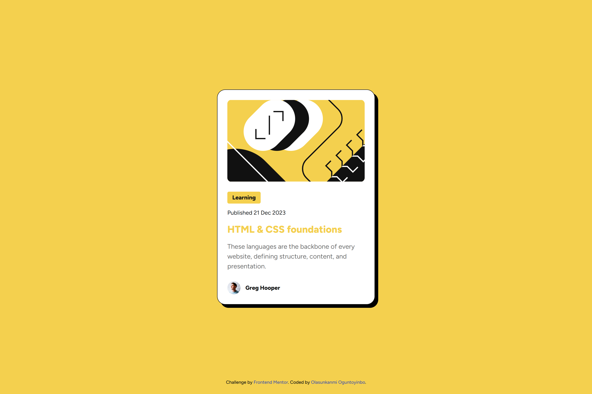
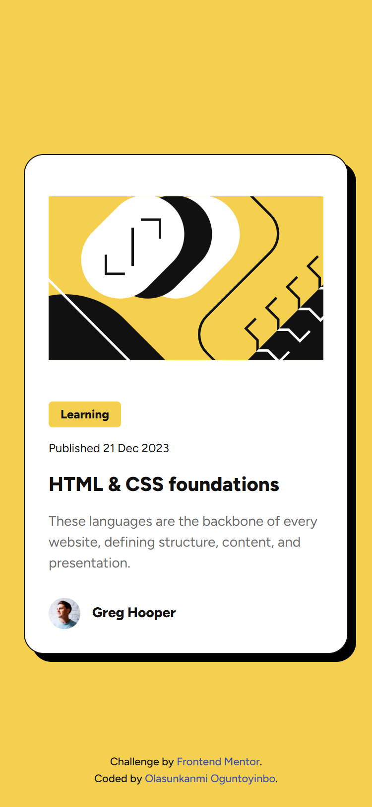

# Frontend Mentor - Blog preview card solution

This is a solution to the [Blog preview card challenge on Frontend Mentor](https://www.frontendmentor.io/challenges/blog-preview-card-ckPaj01IcS). Frontend Mentor challenges help you improve your coding skills by building realistic projects.

## Table of contents

- [Overview](#overview)
  - [The challenge](#the-challenge)
  - [Screenshot](#screenshot)
  - [Links](#links)
- [My process](#my-process)
  - [Built with](#built-with)
  - [What I learned](#what-i-learned)
- [Author](#author)
- [Acknowledgments](#acknowledgments)

## Overview

### The challenge

Users should be able to:

- See hover and focus states for all interactive elements on the page

### Screenshot

### Links

- Solution URL: [https://github.com/Sunkanmyt/blog-preview-card.git](https://github.com/Sunkanmyt/blog-preview-card.git)
- Live Site URL: [https://sunkanmyt.github.io/blog-preview-card/](https://sunkanmyt.github.io/blog-preview-card/)

## My process

### Built with

- Semantic HTML5 markup
- CSS custom properties
- Flexbox

### What I learned

The major thing I learned was how to work with Figma files in replicating the actual design. This project trained my attention to details and helped strengthen my knowledge of pure CSS.

## Author

- GitHub - [@Sunkanmyt](https://github.com/Sunkanmyt)
- Frontend Mentor - [@Sunkanmyt](https://www.frontendmentor.io/profile/yourusername)
- Twitter - [@Sunkanmyt](https://www.twitter.com/yourusername)

## Acknowledgments

A large majority of the knowledge I used in completing this project are things I picked up while learning Web Development from "Traversy Media" on YouTube.
